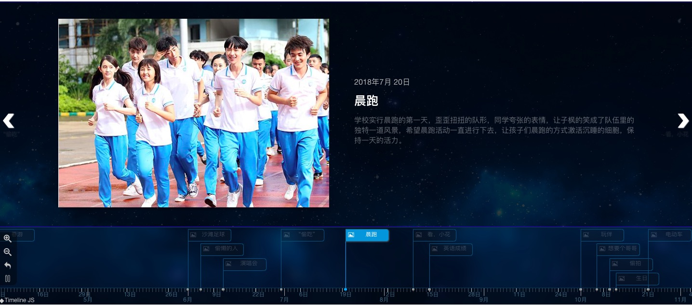

# 基于TimeLinejs3的修改
- 支持import引入
- 支持Swiper轮播

# 使用方法

- npm install timelinezk
- 在需要的文件中 import 'timelinezk';
- 在main.js中 import 'timelinezk/css/timeline.css';

# Swiper的配置
		import 'timelinezk';
		let options = {
			......,
			swiper: {
                isable: true, # 是否支持轮播
                time_gap: 3000, # 轮播的时间间隔
                tag: '' # 定时器标识
            },
            ......
		};
		let timeline = new TL.Timeline(node, timeline_json, options); # 挂载的节点 events事件 配置参数

# 关于language的配置
language还没有很好的入手解决方法 暂时的解决方法如下
- 拷贝插件的js目录下的local语言配置文件到你的项目某一目录
- 在options配置中增加script_path: folder,  folder为你上一步拷贝的目录
- example: 我把local拷贝到项目的static目录下
		let options = {
			......,
			script_path: 'static',
			language: 'zh-cn',
			......
		}

# 关于日期格式的配置
- 最暴力 便捷的是修改loca的配置
- 现在增加一个dayconfig配置项 'day_day'或者 'day_num'
- 'day_day' 显示为  3日  4日
- 'day_num' 显示为  3号  4号
-  无此需求课不填写此配置项  此配置目前只适配中文
- example:
		let options = {  
			......,  
			dayconfig: 'day_day' // 'day_num'  
			......  
		}

# 支持多事件的箭头切换
- 当天的箭头只作用与当天的事件

# 支持一事多图
- 一个事件支持显示多张图片(目前支持最多4张图片)

## 效果图

## Something TODO
- 语言配置的完善
- 目前发现轮播有Bug

# 参考文件
[TimeLine官网](https://timeline.knightlab.com/)  
[TimeLine Github地址](https://github.com/NUKnightLab/TimelineJS3)